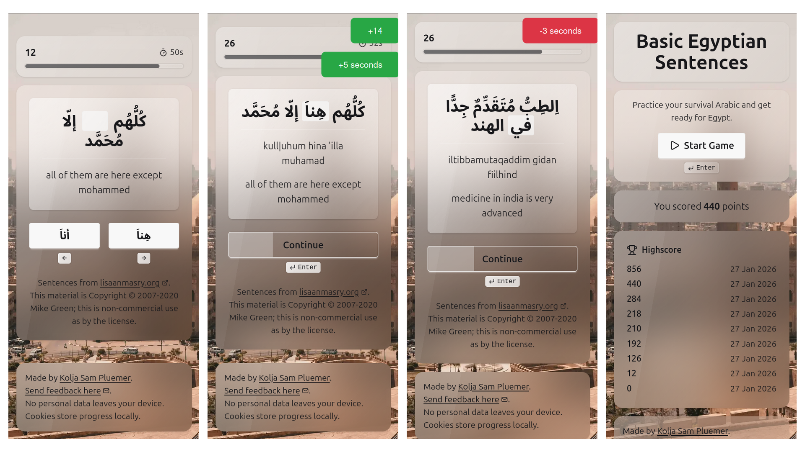

# Basic Egyptian Sentences Game



**[Play Online](https://arz.koljasam.com/)**

Practice essential Egyptian Arabic phrases. 

## About

What more can I say? A small web game to practice sentence useful for daily life in Egypt. Some gamification, some naive Spaced Repetition under the hood. Check it out [here](https://basic-arabic-sentences.koljapluemer.com/)

## Running / Contributing / Experimenting

This a very simple Vue3 app, consisting of a single `App.vue` file, mostly. To run it locally, clone the repository, make sure that you have everything installed to use Vue and run the following commands in the repository's directory:

```
npm i
npm run dev
```

If you have any questions, problems or bugs to report, kindly open an issue. Cheerz!

## Credit

- Background image by [Omar Elsharawy](https://unsplash.com/@esh3rwy?utm_content=creditCopyText&utm_medium=referral&utm_source=unsplash")
- Tech Stack: `Vue`, `Tailwind`, `DaisyUI`.